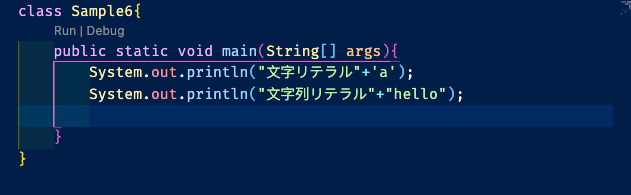
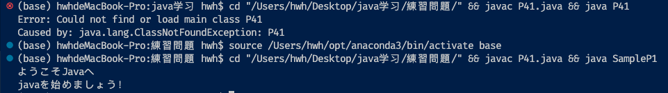
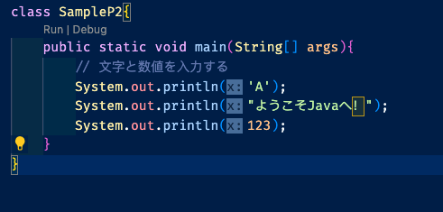
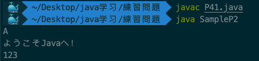
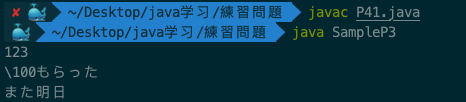
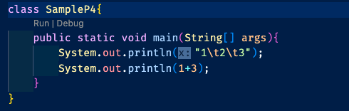
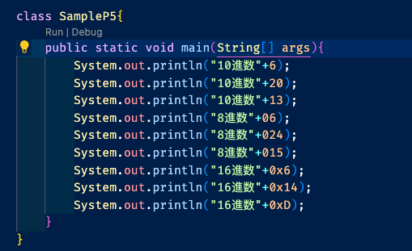
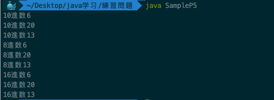
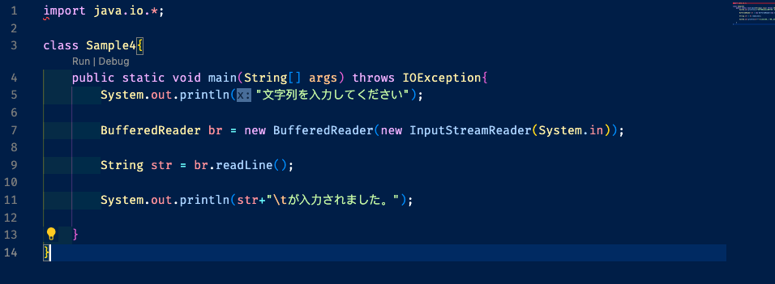
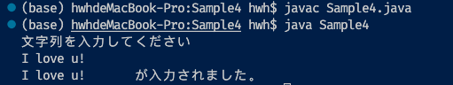

# 第二章

12. <font color="#00FFFF"> 文字列リテラル </font>

* 文字1文字 -> 文字リテラル(character literal)
* 複数の文字の並び -> 文字列リテラル(string literal)
* 文字リテラルは `''`、文字列リテラルは`""` の中に入れています
* 数値リテラル
  * 整数リテラル
  * 浮動小数点数リテラル



13. <font color="#00FFFF"> 数値リテラル </font>

* 数値は `''`や`""` の中に入れていません

* 数値リテラル
  * <font color="#00FFFF">整数リテラル</font>: 1, 3, 100など
    * 一般的な表記法以外にも、色々な書き方があります
      * 8進数：数値の先頭に0をつける
      * 16進数：数値の先頭に0xをつける
      * 10進数、2進数、8進数、16進数の対照表 -> やさしいJava P39
  * <font color="#ADFF2F">浮動小数点数リテラル </font>: 2.1, 3.14, 5.0など

14. 練習 P41~42
    14.1
    * 该代码没有错误
    * 可以通过改行，让代码易于阅读
    * 在VScode上运行错误原因是class的名称不是P41是SampleP1
    
</br>

    14.2
    

    * 运行出class：SampleP2的结果

    
</br>

    14.3
      
  </br>

    14.4
    

    * 只要不是输出单一数字，需要加`""`或者`''`
    * タグ记号不需要特殊的连接符号(+)
    * 输出可以直接进行数值计算
</br>

    14.5
    

    

# 変数

1. 変数(variable)：値を記憶しておく機能

2. 変数は、<font color="#FF0000">メモリ</font>を利用して、値を記憶する仕組みなのです

3. 識別子(identifier): 変数の名前

4. 変数を扱うには、最初に2つのことを決める
   1. 変数に「名前」をつける
   2. 変数の「型」を指定する

5. 識別子の規則 -> P45
   1. 英字、数字、アンダースコア(_)、・、$、などを用います
   2. 長さ制限ない
   3. Javaが予約しているトークンである「キーワード」を使用することはできません。主なキーワードとして、return、classがあります。
   4. 数字で始めることはできません
   5. 大文字と小文字は異なるものとして区別されます

6. 変数の型(type, data type)：
   1. boolean

      * true または false

   2. char
      * 2 bytes文字(\u0000~\uffff)

   3. byte
      * 1 byte整数(-128~127)

   4. short
      * 2 bytes整数(-32768~32767)

   5. int
      * 4 bytes

   6. long
      * 8 bytes

   7. float
      * 4 bytes単精度浮動小数点数

   8. double
      * 8 bytes倍精度浮動小数点数

7. ビット(bit)とバイト(byte)
   * 2進数の値の「1桁分」は、ビット(bit)と呼ぶ
   * 8 bits = 1 byte
   * 1バイトでは、2^8＝256通りの値を表すことができます(1byte可以表示256个不同的值)
     * 1bit： 21 = 2通り
     * 2bit： 22 = 4通り
     * 8bit： 28 = 256通り
     * 16bit： 216 = 6万5536通り
     * 64bit： 264 = 1844京6744兆0737億0955万1616通り
   * 桁数が増えれば増えるほど、表現できる情報量も大きくなる

8. 変数の宣言(declaration)
   ```
   型名  識別子（ここでは変数名）;
   ```
   実際のコード

   ```
   int num;

   char c;

   double db, dd;
   ```
   * Javaでは、変数を使うために、変数を宣言することが必要となっています。

9. 変数への代入
   ```
   変数名 = 式;
   ```

   例のコード -> Sample1.class

   ```
      class Sample1{
      public static void main(String[] args){
         // 変数numを宣言
         int num;
         // 変数numに値を代入する
         num = 3;
         // 変数numの値を出力する
         System.out.println("変数numの値は:\t"+num+"\tです。");
      }
   }

   ```

10. 変数を初期化する

   * 変数を宣言した時、同時に、変数に値を格納する -> 変数を初期化する(initialization)

   ```
   型名 識別子 = 式;
   ```
   
   * コード
   
   ```
   int num = 3;
   ```
   
   * 値を代入しないで出力しようとしても、エラーが出てコンパイルできません。
  
   * いったん代入した変数の値を新しい値に変更することができます。

       * コード
      
      ```
      class Sample2{
         public static void main(String[] args){
            //変数を宣言する
            int num;
            // 変数への代入
            num = 3;
            System.out.println("変数numの値は"+num+"です。");

            // 変数を変更する
            num = 5;
            System.out.println("変数numの値を変更しました。");
            System.out.println("変数numの新しい値は"+num+"です。");
      }
   }
      ```
   * 同時に二つの変数を宣言
      ```
      int a,b ;
      ```
   * 宣言同時に値を代入 ->  初期化
      
      ```
      int a = 3;

      ```

   * 他の変数の値を代入
   
   ```
      class Sample3{
         public static void main(String[] args){
            int num1, num2;
            num1 = 3;
            System.out.println("num1の値は\t"+num1+"\tです。"+"\n");
            num2 = num1;
            System.out.println("num2にnum1の値を代入した。"+"\n");
            System.out.println("num2の値は\t"+num2+"\tです。"+"\n");
         }
      } 
   ```
   * エスケープシーケンス: 改行、水平タブ
     

   * 変数の<font color="#FF0000">宣言の位置</font>についての注意
     * 本書では、変数の宣言を<font color="#ADFF2F">main()メソッドのブロック内</font>に記述します。
     * 実は、main()メソッド『method』の外に変数を宣言する場合もあるのですが、<font color="#ADFF2F">第8章</font>で学ぶことにします。
     * なお、<font color="#ADFF2F">ブロックの中</font>では、名前が重複する変数をいくつも宣言することは<font color="#FF0000">できません</font>。


11. キーボードからの入力 -> 用户输入数值
   * Code
   ```
      import java.io.*//引入java.io下所有包
      io代表input/ouput //输入输出,用来操作流
   ```
   ```
   import java.io.*;

   class クラス名{
      public static void main(String[] args)throws IOException{
         
         ...
         
         BufferedReader br = new BufferedReader(new InputStreamReader(System in));

         String str = br.readLine();  // キーボードから入力した文字列をstrに読み込みます
         // 入力された文字列を表すstrを利用する
         
         ...
         ...
         ...

      }
   }
   ```
   ```
   new InputStreamReader(System.in);
   构造一个InputStreamReader对象，这个对象是 字节流通向字符流的桥梁，它读取字节并将其解码为字符。
   
   new BufferedReader(new InputStreamReader(System.in));
   构造一个BufferedReader，里面存放在控制台输入的字节转换后成的字符。
   
   所以
   BufferedReader br=new BufferedReader(new InputStreamReader(System.in));
   
   拆开写就是：
   InputStream in  = System.in ;
   InputStreamReader isr = new InputStreamReader(in);
   BufferedReader br = new BufferedReader(isr);
   
   获取内容
   str=br.readLine();
   从BufferedReader对象中读取一行的内容
   
   ```

   * Java IO 详解
     


   * このコードでは、
   
   ```
   String ste = br.readLine();
   ```
   * という部分が重要です。この文が処理されたとき、実行画面が<font color="#ADFF2F">ユーザーからの入力を待つ</font>状態で止まります。

   * そこで、ユーザーは文字列などをキーボードから入力し、Enterキーを押します。すると、「str」という部分に、入力した一行の文字列に関する情報が読み込まれます。

   * このため、この文以降、<font color="#ADFF2F">「str」という言葉がキーボードから入力した文字列を意味する</font>ことになります。「str」は識別子なので、別の言葉を使ってもかまいません。

   * bufferedReader和bufferedWriter用法(经典)

      1. java.io.BufferedReader和java.io.BufferedWriter类各拥有8192字符的缓冲区。当BufferedReader在读取文本文件时，会先尽量从文件中读入字符数据并置入缓冲区，而之后若使用read()方法，会先从缓冲区中进行读取。如果缓冲区数据不足，才会再从文件中读取，使用BufferedWriter时，写入的数据并不会先输出到目的地，而是先存储至缓冲区中。如果缓冲区中的数据满了，才会一次对目的地进行写出。

      2. 从标准输入流System.in中直接读取使用者输入时，使用者每输入一个字符，System.in就读取一个字符。为了能一次读取一行使用者的输入，使用了BufferedReader来对使用者输入的字符进行缓冲。readLine()方法会在读取到使用者的换行字符时，再一次将整行字符串传入。

      3. System.in是一个位流，为了转换为字符流，可使用InputStreamReader为其进行字符转换，然后再使用BufferedReader为其增加缓冲功能。


   * throws IOException: 
     * throws: 投；抛（throw 的三单形式）；掷
     * I: input
     * O: output
     * Exception: 异常、例外、除外

   * Sample Code
      ```
      import java.io.*;

      class Sample4{
         public static void main(String[] args) throws IOException{
            System.out.println("文字列を入力してください");

            BufferedReader br = new BufferedReader(new InputStreamReader(System.in));

            String str = br.readLine();

            System.out.println(str+"\tが入力されました。");

         }
      }
      ```
        


        


   * 標準入力と標準出力

      * 標準入力(standard input): キーボードからの入力を受け付けるコードの中の「System.in」という言葉は標準入力と結び付けられています。標準入力通常はコンピュータの「キーボード」のことを意味します。
  
      * 標準出力通常はコンピュータの「画面」のことを意味します。

   * <font color="#ADFF2F">文字列を変換してint型の変数に読み込みます</font>
      
      ```
      // 入力した文字列を表す「str」を整数に変換して、int型の変数numに読み込む
      int num = Integre.parseInt(str);
         // num (変数名)
         // str (変数名)
         // Integer: 整数；完整物，统一体
         // parse: 对（句子）作语法分析；仔细研究，分析
      ```
      ```
      import java.io.*;
      class Sample5{
         public static void main(String[] args) throws IOException{
            System.out.println("整数を入力してください。");

            BufferedReader br = new BufferedReader(new InputStreamReader(System.in));

            String str = br.readLine();

            int num = Integer.parseInt(str);

            System.out.println(num + "が入力されました。");
         }
      }
      ```


   * <font color="#ADFF2F">文字列を変換してdouble型の変数に読み込みます</font>
      ```
      double num = Double.parseDouble(str);
      ```
   * <font color="#ADFF2F">二つの数値を入力する</font>
     * 每一次输入的内容都放在br中
     * 要重复输入只需要重复 br.readLine();
   
   
   * Stringとchar変数の違い
      ```
      String型は、複数の文字列で表すことのできるクラスです。

      intやbyte、char型などの変数とは少し性質の異なり、「クラス型変数」と呼ばれます。

      これに対して、intやchar型などの変数は、「基本データ型変数」と呼ばれるものです。

      String型変数を定義するには、ダブルクォーテーションを使って、

      String 変数名 = “文字列”

      と記述します。

      ```

      ```
      char型は1文字を格納するためのクラスです。

      実際に格納しているデータは「あ」「い」「う」「え」「お」のような文字そのものではなく、コンピュータで扱いやすいような文字コードです。それぞれの文字に割り当てられた数字をデータとして保持しています。

      Javaの文字コードはUnicodeであるため、一つ一つの文字を0～65535の番号に割り当てています。

      char型は2の16乗個のデータを扱うために、16ビット（2バイト）の符号なし整数を保持しています。

      char型を定義するには、シングルクォーテーションで、

      char 変数名 = ‘1文字’

      のように記述します。

      ```

      